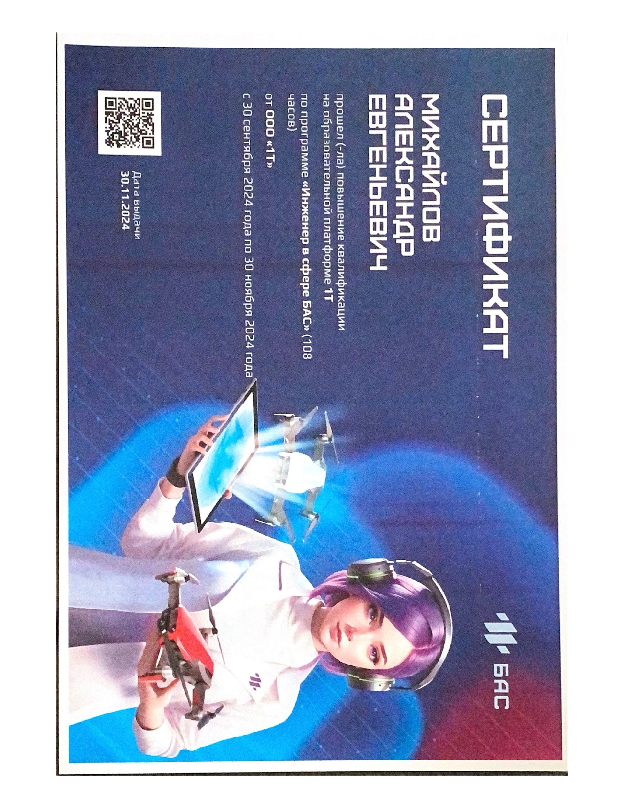

#  Привет, меня зовут Александр👋

## 🚀 Обо мне
- **Нахожусь:** Москва, Россия
- **Студент:** третьего курса НИТУ МИСиС  # исправил "тетьего" → "третьего"
- **Направление:** ИВТ-СП (Информатика и вычислительная техника, системная программная инженерия)
- **Telegram:** [@vlhkm](https://t.me/vlhkm)  
- **Email:** alexander_mikhaylov05@mail.ru

## 🛠 Технический стек
### 🌌 Языки программирования

### 💾 Базы данных

### 🔧 Инструменты и технологии

**Фреймворки и библиотеки:**  

**Веб-технологии:** 

**ОС и окружение:** 

## 📚 Пройденные курсы

| Курс | Платформа | Год | Статус |
|------|-----------|-----|--------|
| **Python-разработчик** | Яндекс Практикум | 2025 |  |
| **ЦК БПЛА 2024-2025** | [МИСИС] | 2024 | |

## 🖼️ Сертификаты 

