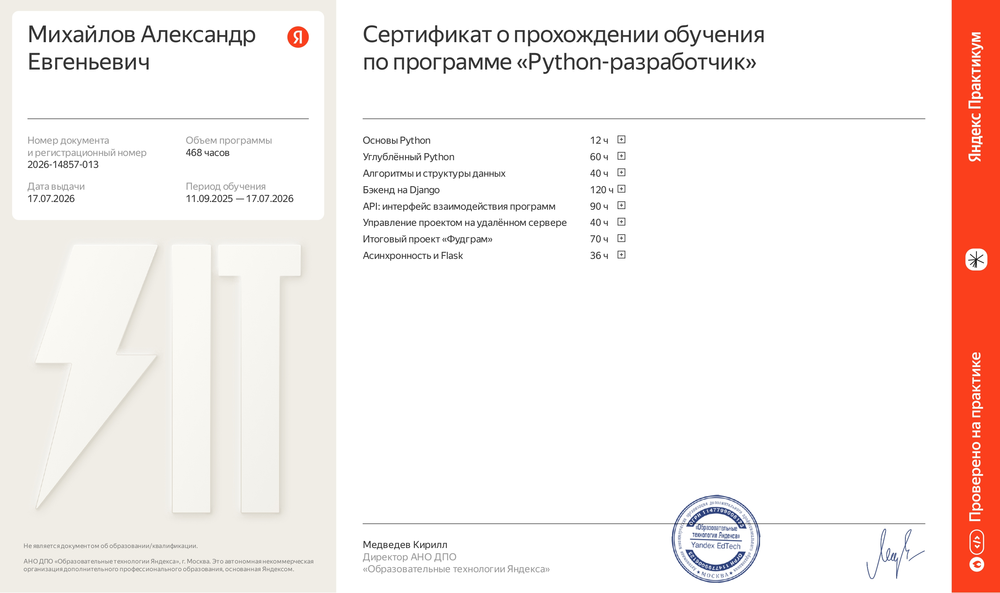
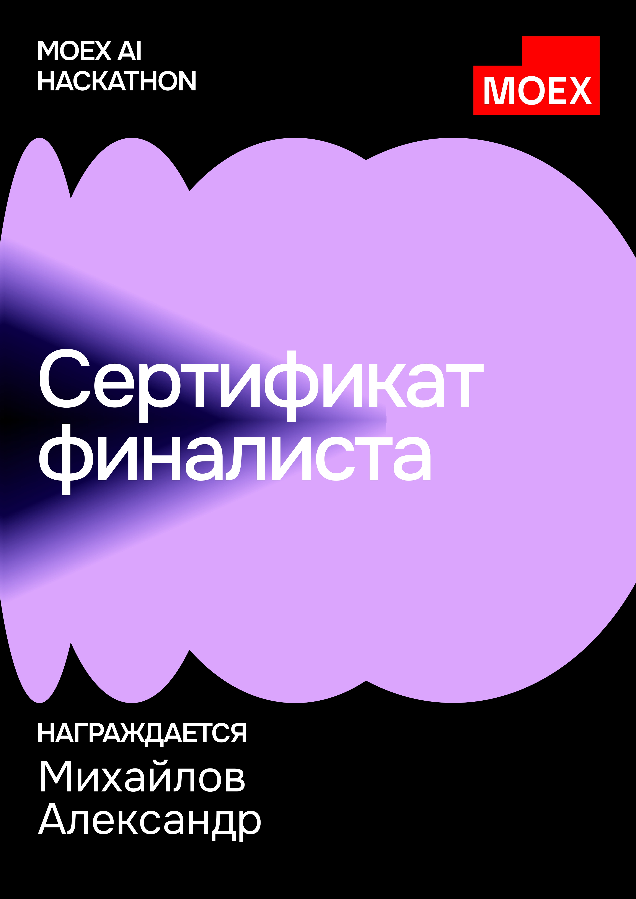
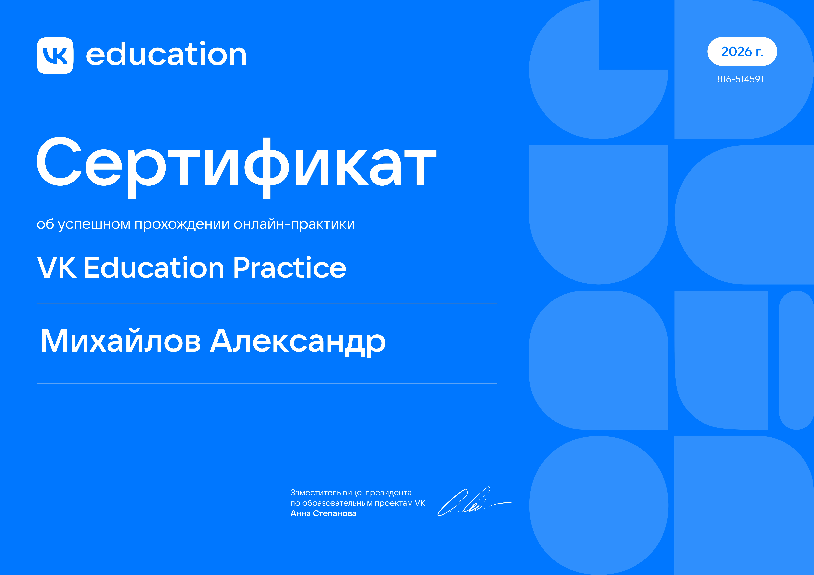
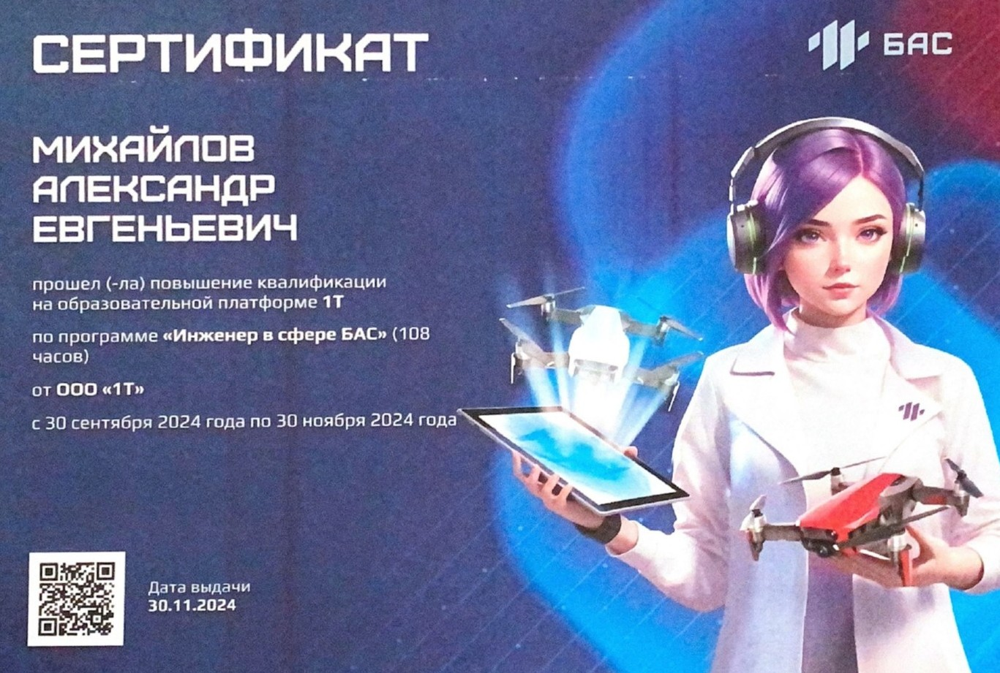
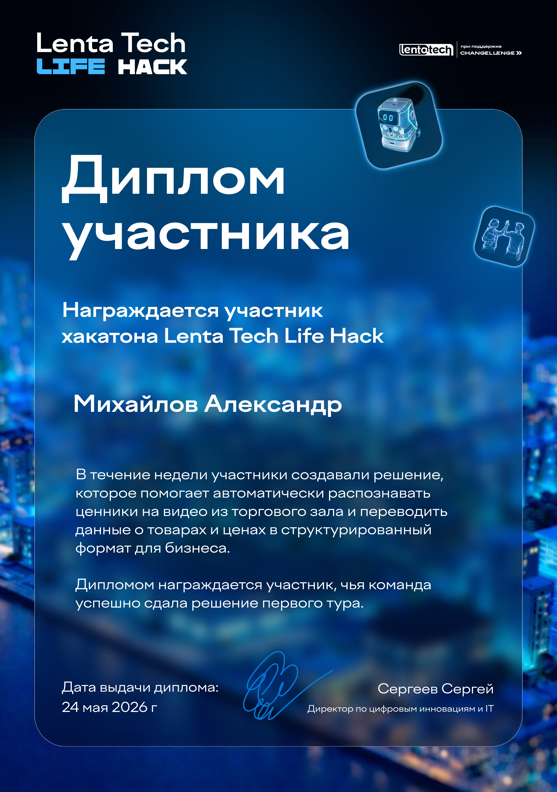
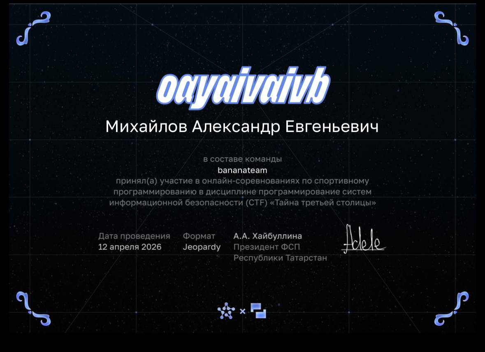
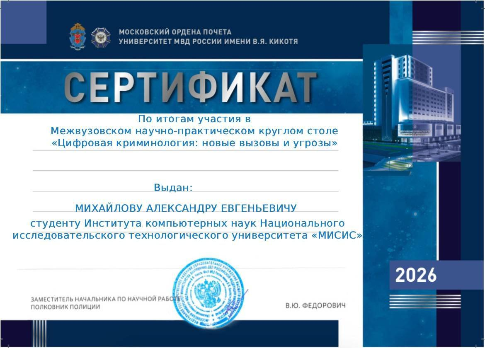
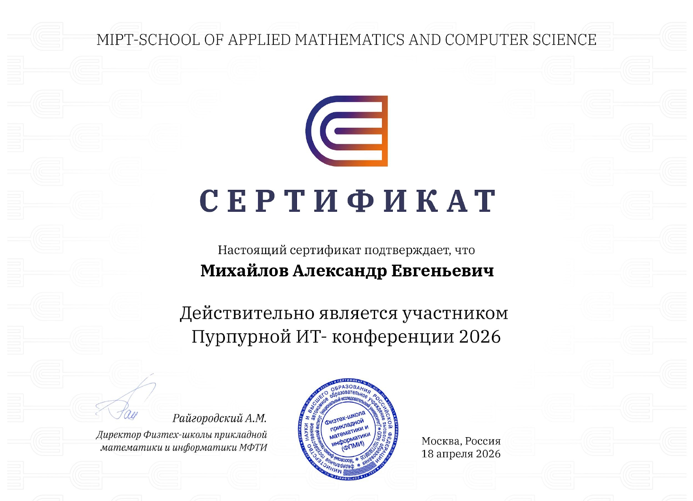

# Привет, меня зовут Александр 👋

## 🚀 Обо мне
#### Python Developer | Backend Developer

#### Разрабатываю backend-приложения и REST API на Python. Работаю с Django/DRF и Flask, проектирую модели и API, занимаюсь тестированием, контейнеризацией и CI/CD.

#### Интересуюсь backend-разработкой, архитектурой приложений, автоматизацией и Data Engineering.

---

## 🛠️ Технологии и инструменты

### Языки

### Backend / Frameworks

### Базы данных

### DevOps / Инфраструктура

### Тестирование

### Frontend / Веб

---

## 🚀 Избранные проекты

### [YaMDb API](https://github.com/oayaivaivb/api-yamdb)
REST API для отзывов на произведения: JWT-аутентификация, 4 роли пользователей, отзывы, комментарии, рейтинг.
> Стек: `Python` `Django` `Django REST Framework` `SQLite`

### [Mini-Lakehouse — Banking Anti-Fraud Platform](https://github.com/oayaivaivb/mini-lakehouse)
Lakehouse-платформа для антифрода: федеративные JOIN между PostgreSQL и S3 через Trino, Time Travel на Iceberg.
> Стек: `Trino` `Apache Iceberg` `MinIO` `PostgreSQL` `Docker` `SQL`

### [YaCut](https://github.com/oayaivaivb/async-yacut)
Сервис укорачивания ссылок с REST API и асинхронной загрузкой файлов на Яндекс Диск.
> Стек: `Python` `Flask` `SQLAlchemy` `aiohttp` `SQLite` `Bootstrap`

### [Foodgram](https://github.com/oayaivaivb/foodgram)
Fullstack-приложение для публикации рецептов: избранное, подписки, список покупок, короткие ссылки.
> Стек: `Python` `Django REST Framework` `Djoser` `PostgreSQL` `Docker` `Nginx` `Gunicorn` `CI/CD`

### [Криминология (общая часть)](https://github.com/oayaivaivb/criminology_studentsbook)
Электронный учебник по криминологии: 9 глав, глоссарий, библиография, PDF и видео.
> Стек: `Python` `Django` `Bootstrap 5` `SQLite` `HTML` `Render.com`
---

## 🖼️ Сертификаты

<table>
  <tr>
    <td align="center">
       
      <b>Яндекс Практикум</b>
    </td>
    <td align="center">
       
      <b>MOEX AI Hackathon</b>
    </td>
  </tr>
  <tr>
    <td align="center">
       
      <b>VK Практика</b>
    </td>
    <td align="center">
       
      <b>T1</b>
    </td>
  </tr>
  <tr>
    <td align="center">
       
      <b>Lenta Hackathon</b>
    </td>
    <td align="center">
       
      <b>CTF «Тайна третьей столицы»</b>
    </td>
  </tr>
  <tr>
    <td align="center">
       
      <b>Круглый стол</b>
    </td>
    <td align="center">
       
      <b>Purple Conf</b>
    </td>
  </tr>
</table>

---

## 📫 Контакты

  
  

---

  <i>⭐️ From <a href="https://github.com/oayaivaivb">oayaivaivb</a></i>

